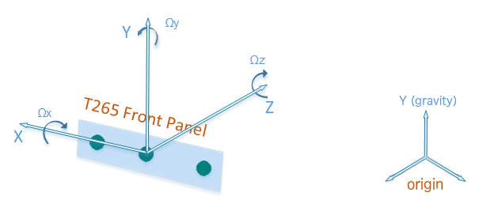
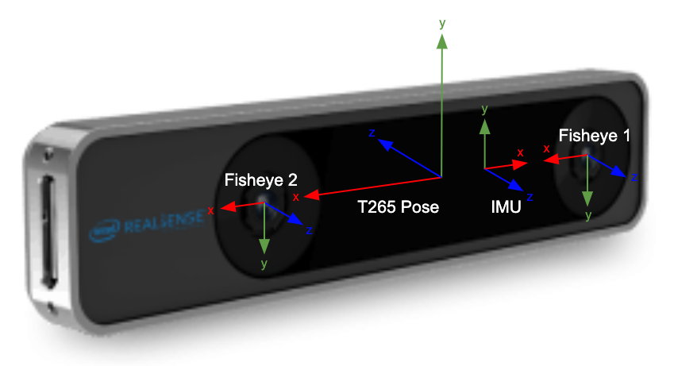
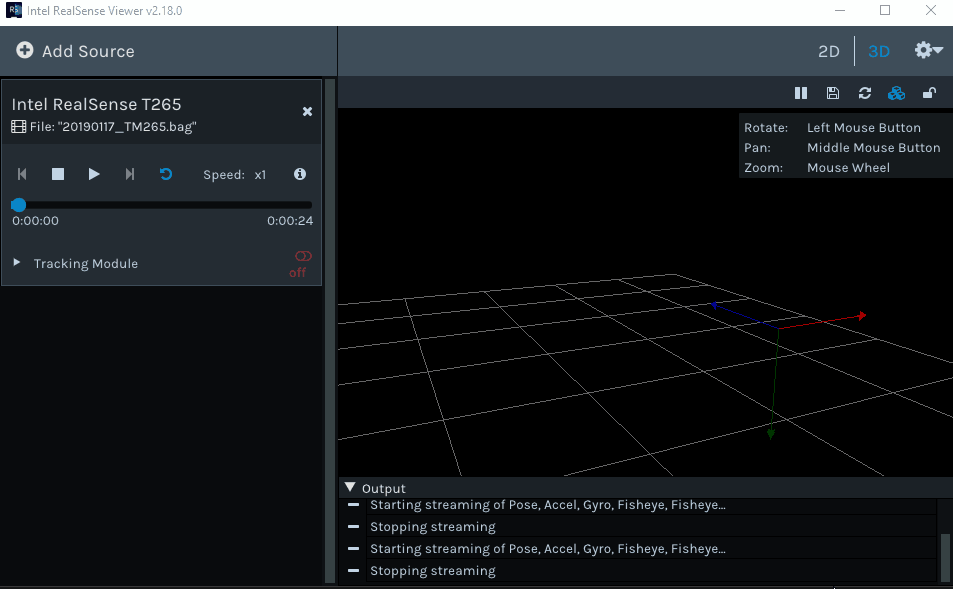
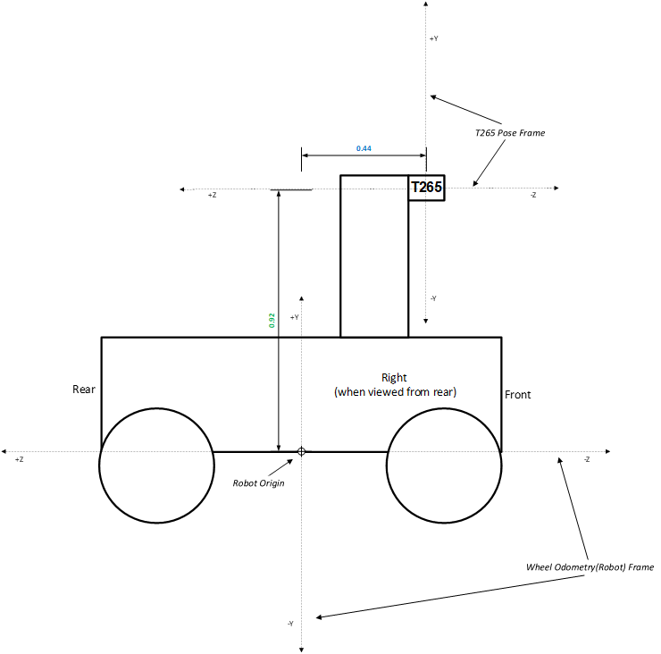

# Intel RealSense(TM) Tracking Camera R265

> このドキュメントは [https://github.com/IntelRealSense/librealsense/blob/master/doc/t265.md](https://github.com/IntelRealSense/librealsense/blob/master/doc/t265.md) を翻訳したものです。

Intel RealSense(TM) トラッキングカメラ T265 は、魚眼レンズ、IMU、およびIntel Movidius(TM) Myriad(TM)  2 VPU を搭載したグレースケールカメラです。すべての V-SLAM アルゴリズムは VPUで直接実行されるため、非常に低いレイテンシと非常に効率的な電力消費(1.5W)での動作が可能です。

RealSense SDK は現在T265をROSラッパを介してWindowsおよびLinux上での動作をサポートしています。

## メモ/既知の問題

* 車輪付きロボットの場合、オドメトリ（走行距離）入力は検討かつ正確なトラッキング実現のための要件の一つです。関連するAPIは、今後のリリースで `librealsense` および ROS/realsense に追加されます。現時点のAPIは、サードパーティのデバイスドライバを使用しています。
* 現時点の位置再特定(リローカリゼーション) API は安定していません、将来のリリースで更新される予定です。
* Android サポートは、OpenVR統合同様、将来リリースされる予定です。

## センサの原点および座標系

T265 トラッキングデバイスは、AR/VR統合を見込み、SDK標準の代わりにデファクトVRフレームワーク標準を使用しています。



1. X軸正方向は、本体中心から右カメラへの向きとなる
2. Y軸正方向は、本体中心から真上への向きとなる
3. Z軸性方向は、本体中心から本体背面への向きとなる

原点は、左右カメラの中間点となります。

トラッキングを開始すると、原点座標系が作成され、RealSense SDKは関連するT265の位置情報(pose)を提供します。提供される位置情報のY軸は重力にあわせており、上方向が正となります。X軸とZ軸はグローバルに設定されませんが、トラッキング開始時のT265デバイスの向きをベースとしてカメラ軸から地表面への射影としてZ軸負方向が初期化されます。これは、ドローンなどで下向きの構成でデバイスを起動したときに、初期ヨーがランダムに見える可能性があることを意味します。すべてのT265（および `librealsense` ）座標系は右手系です。

## キャリブレーション

IMUを含むT265上のセンサは（D435iのIMUとは異なり）製品ラインで較正されるため、追加の較正プロセスは必要ありません。参照してください。基本的なカメラやIMUのためのセンサの組み込み関数とextrinsicsを取得し、使用する方法については、例。

カメラやIMU の使い方は、 [ra-ar-basic](https://github.com/IntelRealSense/librealsense/tree/master/examples/ar-basic) のサンプルコードを参照してください。

次の図は各センサの向きを示しています：



## タイムスタンプ

T265は `RS2_TIMESTAMP_DOMAIN_GLOBAL_TIME` 内に全センサの時刻をレポートします。これは、ホストコンピュータとT265の間の時刻同期メカニズムを使用して、すべてのセンサデータのタイムスタンプをミリ秒の正確なホストクロック時間で提供します。

## サンプルコードおよびツール

T265で動作する `librealsense` を使ったサンプルコードやツールは、以下のとおりです（ [C++サンプルコード](https://github.com/IntelRealSense/librealsense/blob/master/examples) 、[Pythonサンプルコード](https://github.com/IntelRealSense/librealsense/blob/master/wrappers/python/examples) 、 [ツール](https://github.com/IntelRealSense/librealsense/blob/master/tools) リンクを参照してください）。

### C++サンプルコード

* [rs-pose](https://github.com/IntelRealSense/librealsense/blob/master/examples/pose) - 基本的な位置情報の取得
* [rs-pose-predict](https://github.com/IntelRealSense/librealsense/blob/master/examples/pose-predict) -  `librealsense` のグローバル時刻とコールバックAPIを使った姿勢予測デモ
* [rs-pose-and-image](https://github.com/IntelRealSense/librealsense/blob/master/examples/pose-and-image) - 200MHz 位置情報と 30MHz イメージを含むトラッキングカメラを非同期に使う方法
* [rs-pose-apriltag](https://github.com/IntelRealSense/librealsense/blob/master/examples/pose-apriltag) - T265魚眼イメージストリームから [Apriltag](https://github.com/AprilRobotics/apriltag/tree/3.1.1) 位置情報を算出する方法
* [rs-ar-basic](https://github.com/IntelRealSense/librealsense/blob/master/examples/ar-basic) - 位置情報と魚眼フレームを使った、魚眼イメージに単純な仮想オブジェクトを表示する方法
* [rs-tracking-and-depth](https://github.com/IntelRealSense/librealsense/blob/master/examples/tracking-and-depth) - トラッキングカメラと深度カメラを使った、性的な参照フレームに3D点群(3Dポイントクラウド)を表示する方法
* [rs-trajectory](https://github.com/IntelRealSense/librealsense/blob/master/examples/trajectory) - 位置情報に基づいたデバイス動作の3D軌跡を描く方法
* [rs-capture]() - センサデータの2D可視化
* [rs-save-to-disk](https://github.com/IntelRealSense/librealsense/blob/master/examples/save-to-disk) - カメラの設定方法やPNG形式ファイルの保存
* [rs-multicam](https://github.com/IntelRealSense/librealsense/blob/master/examples/multicam) - 別々のウィンドウで複数のカメラストリームを同時に処理
* [rs-software-device](https://github.com/IntelRealSense/librealsense/blob/master/examples/software-device) - カスタム `rs::device` の構築方法
* [rs-sensor-control](https://github.com/IntelRealSense/librealsense/blob/master/examples/sensor-control) - `rs::sensor` API を使うチュートリアル

### Python サンプルコード

* [T265 Basic](https://github.com/IntelRealSense/librealsense/blob/master/wrappers/python/examples/t265_example.py) - T265から位置情報を取得する方法
* [T265 Coordinates](https://github.com/IntelRealSense/librealsense/blob/master/wrappers/python/examples/t265_rpy.py) - T265位置情報の座標系を変更する方法
* [T265 Stereo](https://github.com/IntelRealSense/librealsense/blob/master/wrappers/python/examples/t265_stereo.py) - OpenCVでT265組み込み関数と外部関数を使用して、ホスト上のT265魚眼画像から深度マップを非同期に計算する方法

### ツール

* [enumerate-devices](https://github.com/IntelRealSense/librealsense/blob/master/tools/enumerate-devices) - 接続されたデバイスに関する情報を提供するコンソールアプリケーション
* [recorder](https://github.com/IntelRealSense/librealsense/blob/master/tools/recorder) - 単純なコマンドラインrawデータレコーダ
* [data-collect](https://github.com/IntelRealSense/librealsense/blob/master/tools/data-collect) - 様々なストリームに関する統計情報の収集

### Realsense Viewer

他のRealsenseカメラ同様、T265は `realsense-viewer` が動作します。
位置情報の3D視覚化を含む、すべてのセンサストリームの視覚化を提供します。


IMUおよびトラッキングデータのストリームは、SDKの組み込み recorder ユーティリティと完全に互換性があります。



ROS `.bag` 形式の画像を含むrawセンサデータを記録する場合は、 [recorder](https://github.com/IntelRealSense/librealsense/blob/master/tools/recorder) の使用をお勧めします。

## API

位置情報とIMUデータは、サポートされている他のセンサ同様に、SDKによって処理されます。したがって、センサアクセスおよび呼び出しAPIは、D400やSR300の深度/RGBセンサの呼び出し方に似ています。

```c++
rs2::pipeline pipe;

rs2::config cfg;
cfg.enable_stream(RS2_STREAM_GYRO);
cfg.enable_stream(RS2_STREAM_ACCEL);
cfg.enable_stream(RS2_STREAM_POSE);

pipe.start(cfg);

while (app) // アプリケーションが生きている間
{
    rs2::frameset frameset = pipe.wait_for_frames();

    // IMUかつ/もしくは トラッキングデータの検索および取得
    if (rs2::motion_frame accel_frame = frameset.first_or_default(RS2_STREAM_ACCEL))
    {
        rs2_vector accel_sample = accel_frame.get_motion_data();
        //std::cout << "Accel:" << accel_sample.x << ", " << accel_sample.y << ", " << accel_sample.z << std::endl;
        //...
    }

    if (rs2::motion_frame gyro_frame = frameset.first_or_default(RS2_STREAM_GYRO))
    {
        rs2_vector gyro_sample = gyro_frame.get_motion_data();
        //std::cout << "Gyro:" << gyro_sample.x << ", " << gyro_sample.y << ", " << gyro_sample.z << std::endl;
        //...
    }

    if (rs2::pose_frame pose_frame = frameset.first_or_default(RS2_STREAM_POSE))
    {
        rs2_pose pose_sample = pose_frame.get_pose_data();
        //std::cout << "Pose:" << pose_sample.translation.x << ", " << pose_sample.translation.y << ", " << pose_sample.translation.z << std::endl;
        //...
    }
}
```

## FAQ

### 深度カメラはありますか ?

いいえ、T265は深度情報を提供していません。位置と方向(6-DOF)、IMU(加速度とジャイロスコープ)、２つのモノクロ魚眼レンズストリームを提供しています。

### 深度カメラと一緒に使用できますか ?

はい。T265はRealSense（およびほとんどのサードパーティ製品の）深度カメラを使用することができます。パッシブでIRカットフィルタが付属しています。

### カメラの組み込み関数と外部関数を使用するにはどうすればいいですか ?

T265は [Kanalla-Brandt歪みモデル](http://www.ee.oulu.fi/research/mvmp/mvg/files/pdf/pdf_697.pdf) を使用しています。このモデルは、OpenCVを使って魚眼モデルの一部としてサポートされています。カメラの組み込み関数と外部関数により、 [ホスト上でOpenCVを使用しT265イメージから深度を計算するPythonサンプルコード](https://github.com/IntelRealSense/librealsense/blob/master/wrappers/python/examples/t265_stereo.py) を参照してください。またカメラの組み込み関数と外部関数を使って [仮想オブジェクトを表示するC++サンプルコード](https://github.com/IntelRealSense/librealsense/blob/master/examples/ar-basic) も参照してください。

### どのプラットフォームがサポートされていますか?

T265は、Windows、Linux、macOS上の `librealsense` および `ros-realsense` を介してサポートされています。Androidのサポートは計画されていますが、まだリリース予定はありません。OpenVR統合も同様です。

### システム要件は何ですか ?

1秒間に200回市政情報を受信できるUSB2を搭載したボードであることです。デバイスは Intel NUC プラットフォームで検証されています。魚眼レンズストリームへのアクセスには、USB3が必要となります。

### D435i でソフトウェアパッケージとして同じSLAMを使用できますか ?

調査中です。しばらくお待ち下さい。

### ホィールオドメトリとは何ですか?T265のナビゲートにどのように役に立ちますか ?

ホィールオドメトリ（車輪走行距離計測）は、車輪の回転量を測定するセンサを使用て走行距離を計測する方法のことで、車輪付きロボットの位置変化を推定するために使用できます。T265にはホィールオドメトリサポートが組み込まれているため、これらのセンサからのデータを使ってロボットのいちデータを補正できます。USBを介してTM2にロボットホィールオドメータまたは速度計のデータと対応するキャリブレーションデータを提供すると、車輪付きロボットのトラッキングがより堅牢になります。校正ファイルの形式については、次のセクションで解説します。オドメータ入力は、車輪付きロボットの堅牢なトラッキングの要件であると考えています。

### T265は屋内でも/屋外でも使用できますか ?

はい。T265は屋内でも屋外でもどちらでも使用できます。ただし人同様、目をまっすに照らす光で目がくらむ可能性があり、真っ暗闇では何も見えません。

### 複数のT265デバイスは相互に干渉しますか ?

いいえ。1つのスペースで好きなだけT265デバイスを使うことができます。

### T265固有のオプションはありますか ?

はい、あります。

* `RS2_OPTION_ENABLE_MAPPING` - 内部マップにより、デバイスは以前の場所を認識できるため、その場所に一貫した位置情報を与えることができます。マップのサイズは固定されており、最も頻繁に/最近見られた場所を保持します。これがないと、完全にオープンループで動作し（つまり、VIOを実行するだけ）、ドリフトが大きくなります。デバイスはマップを使用して、ささやかなループを閉じ、小さなドリフトから回復します。このオプションを有効にしても、`RS2_OPTION_ENABLE_POSE_JUMPING` がなければ位置情報のジャンプは発生しません。
* `RS2_OPTION_ENABLE_POSE_JUMPING` - このオプションを使用すると、デバイスは位置情報が以前に与えたものと矛盾することがわかったときに、その位置情報を不連続にジャンプすることができます。たとえば、円を描いて歩いたり、カメラを覆ったり（小さなドリフトを取得したり）、それらが明らかになったときなどです。現在、これは平行移動にのみ影響し、回転や速度や加速度には影響しません。
* `RS2_OPTION_ENABLE_RELOCALIZATION` - これにより、デバイスは誘拐ロボット問題（[Kidnapped Robot Problem](https://en.wikipedia.org/wiki/Kidnapped_robot_problem)）を解決することができます。つまり、大きなドリフトを蓄積した後、たとえば大きなループを閉じたりカメラを覆って歩き回った後、現在のマップをロード済みのマップに接続したり、現在のマップをそれ自体に接続したりすることができます。これは、姿勢位情報のジャンプとは無関係です。ロボットがだまされた場合、この機能は基本的なマッピングよりもはるかに大きなエラーにつながる可能性があります。
* `RS2_OPTION_ENABLE_MAP_PRESERVATION` - このオプションを使用すると、デバイスは、停止/開始呼び出し間で現在のマップを保持できます。デバイス停止後にマップが保存され、次の開始前にロードされたかのように機能します。これは、バージョン2.29.0以下でのデフォルトでした。

> 【訳者注】**誘拐ロボット問題（[Kidnapped Robot Problem](https://en.wikipedia.org/wiki/Kidnapped_robot_problem)）** ：ロボットが動作中、誘拐され別の場所へ移動させられたとき、ロボットが実際にはどこにいるのかわからないのに、知っていると信じてしまうため、大域的位置測定よりも難しくなる問題。どんなに最新式のいち特定プログラムを使っていたとしても、何らかの問題で位置特定不能な時間が発生する可能性は低くない。ロボットのような自律型エージェントは、誤りからの回復能力は必須となる。

## 付録

### 位置情報形式

以下のコードは、各フィールドを解説するインラインコメント付きのサンプルです（コメント有りの状態では有効なファイル形式では有りません、`// コメント文字列` を削除のこと）。これは一時的な解決方法としての提供であり、より統一されたインターフェイスが提供されることに注意してください。

```json
{
    "velocimeters": [ // 速度センサの配列（現在最大2個までサポート）
        {
            "scale_and_alignment": [ // 3X3 行列、row-major (測定値を乗算)
                1.0,
                0.0000000000000000,
                0.0000000000000000,
                0.0000000000000000,
                1.0,
                0.0000000000000000,
                0.0000000000000000,
                0.0000000000000000,
                1.0
            ],
            "noise_variance": 0.004445126050420168, // 測定共分散（決定/調整対象）
            "extrinsics": { // T265ボディフレームに関してセンサフレームの相対変換
                "T": [ // 変換(メートル単位)
                    -0.5059,
                    -0.6294,
                    -0.6873
                ],
                "T_variance": [ // 現在使用されていない、無視すること
                    9.999999974752427e-7, 
                    9.999999974752427e-7, 
                    9.999999974752427e-7
                ],
                "W": [ // 軸角度表現の方向、軸角度（rad）
                    -1.1155,
                    -1.1690,
                    -1.2115
                ],
                "W_variance": [ // 現在使用されていない、無視すること
                    9.999999974752427e-5, 
                    9.999999974752427e-5, 
                    9.999999974752427e-5
                ]
            }
        }
    ]
}
```

### ホィールオドメトリの外部キャリブレーションサンプル

* すべてのキャリブレーションメトリックは、T265原点フレームに関連しています。つまり、T265原点からロボットの原点までのオフセット/回転です。別の言い方をすると、ポイントをフレーム `B` （ロボット走行距離）からフレーム `A` （T265 位置情報）または `A_p = H_AB * B_p` に変換します。ここで、`A_p`はフレーム `A` で表される点、`B_p` はフレーム `B` で表される点、 `H_AB` は対応する同次変換です。
* T265がオドメトリデータを正しく消費して使用するには、ロボットの原点がそれ自体に対してどこにあるかを知る必要があります。これは、キャリブレーション（json）ファイルをこの初期データとともに`librealsense` APIに供給することで実現されます。

以下の基本的なサンプルロボットのセットアップでは、簡単にするためにカメラのX軸とロボットの座標系が位置合わせされ（+ Xが画面から出てくる）、Y軸とZ軸にのみ関係していると仮定しています。



対応するJSON：

```json
{
   "velocimeters": [
       {
           "scale_and_alignment": [
               1.0,
               0.0,
               0.0,
               0.0,
               1.0,
               0.0,
               0.0,
               0.0,
               1.0
           ],
           "noise_variance": 0.00004445126050420168,
           "extrinsics": {
               "T": [
                   0.0,      // 変換なし
                   -0.92,   // カメラの下0.92m(Y軸マイナス方向)
                   0.44    // カメラの0.44m後方(Z軸プラス方向)
               ],
               "T_variance": [
                   9.999999974752427e-7,
                   9.999999974752427e-7,
                   9.999999974752427e-7
               ],
               "W": [
                   0.0,
                   0.0,
                   0.0
               ],
               "W_variance": [
                   9.999999974752427e-5,
                   9.999999974752427e-5,
                   9.999999974752427e-5
               ]
           }
       }
   ]
}
```

この例では、上記のセットアップを使用して、カメラのX軸を中心とした回転を追加します。


対応するJSON：

```json
{
   "velocimeters": [
       {
           "scale_and_alignment": [
               1.0,
               0.0,
               0.0,
               0.0,
               1.0,
               0.0,
               0.0,
               0.0,
               1.0
           ],
           "noise_variance": 0.00004445126050420168,
           "extrinsics": {
               "T": [
                   0.0,      // 変換なし
                   -0.92,   // カメラの下0.92m(Y軸マイナス方向)
                   0.44    // カメラの0.44m後方(Z軸プラス方向)
               ],
               "T_variance": [
                   9.999999974752427e-7,
                   9.999999974752427e-7,
                   9.999999974752427e-7
               ],
               "W": [
                   -0.7853982,  // -0.78rad (-π/4) カメラのX軸の周り
                   0.0,
                   0.0
               ],
               "W_variance": [
                   9.999999974752427e-5,
                   9.999999974752427e-5,
                   9.999999974752427e-5
               ]
           }
       }
   ]
}
```
